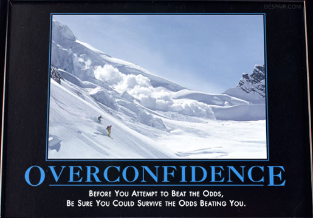

!SLIDE center
# You #

!SLIDE bullets incremental
* Over-eagerness turns people off
* Arrogance turns people off
* Promises are often broken
* Negative or not enough personal capital

!SLIDE bullets incremental
* If you have to complain, at least have a valid complaint
* Don't over-commit. Have defined goals even if they're internal to you
* Don't make **TOO** big a deal of it
* Don't write checks your ass can't cash
* Major on the majors. Minor on the minors
* Sometimes you have to go slow.
